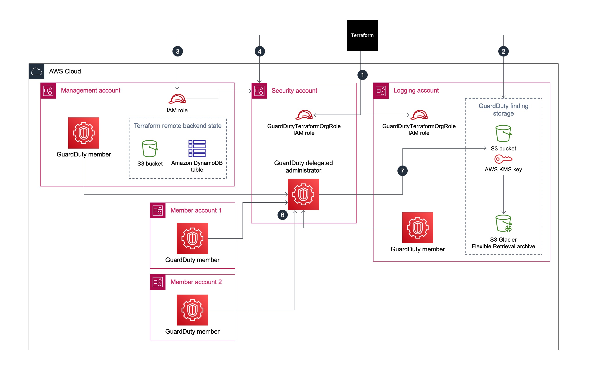

# Use Terraform to automatically enable Amazon GuardDuty for an organization

Amazon GuardDuty continuously monitors your Amazon Web Services (AWS) accounts and uses threat intelligence to identify unexpected and potentially malicious activity within your AWS environment. Manually enabling GuardDuty for multiple accounts or organizations, across multiple AWS Regions, or through the AWS Management Console can be cumbersome. You can automate the process by using an infrastructure as code (IaC) tool, such as Terraform, which can provision and manage multi-account, multi-Region services and resources in the cloud.

AWS recommends using AWS Organizations to set up and manage multiple accounts in GuardDuty. This pattern adheres to that recommendation. One benefit of this approach is that, when new accounts are created or added to the organization, GuardDuty will be auto-enabled in these accounts for all supported Regions, without the need for manual intervention.
This pattern demonstrates how to use HashiCorp Terraform to enable Amazon GuardDuty for three or more Amazon Web Services (AWS) accounts in an organization. The sample code provided as open-source with thise pattern does the following:

•	Enables GuardDuty for all AWS accounts that are current members of the target organization in AWS Organizations

•	Turns on the Auto-Enable feature in GuardDuty, which automatically enables GuardDuty for any accounts that are added to the target organization in the future

•	Allows you select the Regions where you want to enable GuardDuty

•	Uses the organization’s security account as the GuardDuty delegated administrator

•	Creates an Amazon Simple Storage Service (Amazon S3) bucket in the logging account and configures GuardDuty to publish the aggregated findings from all accounts in this bucket

•	Assigns a life-cycle policy that transitions findings from the S3 bucket to Amazon S3 Glacier Flexible Retrieval storage after 365 days, by default 

You can manually run this sample code, or you can integrate it into your continuous integration and continuous delivery (CI/CD) pipeline.

The code in this repository helps you set up the following target architecture.

For prerequisites and instructions for using this AWS Prescriptive Guidance pattern, see [Use Terraform to automatically enable Amazon GuardDuty for an organization](https://docs.aws.amazon.com/prescriptive-guidance/latest/patterns/use-terraform-to-automatically-enable-amazon-guardduty-for-an-organization.html).

### Detailed Documentation
#### Components Included
- Terraform Code *import-org* - to store the resource config of the imported AWS Organization
- Terraform Code *create-delegatedadmin-acct-role* - to create role for the Management account to assume in the security account
- Terraform Code *create-logging-acct-role* - to create role for the Management account to assume in the logging account
- Terraform Module and Code *enable-gd* - to enable GuardDuty for different regions
- Terraform Module and Code *create-gd-bucket-and-key* - to create an S3 bucket in the logging account and KMS key in the security account to store GuardDuty findings; also has a lifecycle policy to transition items to Glacier after 'n' days

#### Resources created (list is not exhaustive)
- S3 bucket for GuardDuty findings
- KMS key for encrypting the S3 bucket and an alias for the key
- S3 lifecycle policy to move findings to S3 Glacier after 'n' days
- GuardDuty Detectors for each of the accounts in each target region
- Delegated admin to designate the security account as admin for GuardDuty
- Relevant IAM roles and policies for all the above

#### Templates
CloudFormation template files with stubs have been provided under cfn-templates/. Run the scripts/replace_config_stubs.sh script to replace the stubs with values provided in the configuration.json file. This will generate the following CloudFormation YAML files:
- *management-account-role.yaml* – This file contains the role definition and the associated permissions for the IAM role in the management account, which has the minimum permissions required to complete this pattern
- *role-to-assume-for-role-creation.yaml* – This file contains the role definition and the associated permissions for the IAM role in the security and logging accounts, which is used by Terraform to create the GuardDutyTerraformOrgRole in these accounts

#### Scripts
The scripts provided under *scripts/* folder are used to automate the entire process. 

- *[scripts/full-setup.sh](scripts/full-setup.sh)*:
    - Main script to setup the entire workflow
- *[scripts/replace_config_stubs.sh](scripts/replace_config_stubs.sh)*:
    - Script to generate CloudFormation YAML files for IAM roles creation
- *[scripts/cleanup-gd.sh](scripts/cleanup-gd.sh)*:
    - Script to cleanup all the resources setup with scripts/full-setup.sh except importing the org

##### Internal scripts
- *[scripts/generate-backend.sh](scripts/generate-backend.sh)*:
    - Internal Script used by scripts/full-setup.sh to generate code for backend.tf files
- *[scripts/generate-tfvars.sh](scripts/generate-tfvars.sh)*:
    - Internal Script used by scripts/full-setup.sh to generate terraform.tfvar files
- *[scripts/create-roles.sh](scripts/create-roles.sh)*: 
    - Internal Script used by scripts/full-setup.sh to create IAM roles
- *[scripts/setup-gd.sh](scripts/setup-gd.sh)*:
    - Internal Script used by scripts/full-setup.sh to import org and enable GuardDuty

#### Outputs
The following outputs are generated from the module *tfm-gd-enabler*:
- *guardduty_detector* - The GuardDuty detector ID in each region.

#### Additional Notes
#### Region Selection for enabling GuardDuty
1) AWS GuardDuty is available in several regions. This is obtained as a list via an API call in the Python script.
2) The Delegated Administrator account has its own list of allowed regions i.e., regions which are not disabled and are either opted in by the account owner or opt-in is not required. This is obtained as a separate list via another API call.
3) The intersection of the lists from (1) and (2) provide us with an "allowed list" of regions where GuardDuty can be enabled without errors. 
4) There is a configuration field *target_regions* in [configuration.json.sample](configuration.json.sample) which is a comma-separated list of preferred regions where GuardDuty needs to be enabled in the current organization. Each region specified in the *target_regions* configuration is compared with the "allowed list" from (3) before proceeding to enable GuardDuty in those preferred regions.

##### How to add support for new regions to deploy GuardDuty?
Add the new region(s) to the *target_regions* configuration field in [configuration.json.sample](configuration.json.sample) file and follow the steps in the pattern to deploy.

##### Handling addition of new members:
- Once GuardDuty is enabled in the Organization, new members are automatically included in the purview of the Delegated admin.
- GuardDuty is automatically turned on in the new member account and other settings are configured. 
- In order to selectively update the state in Terraform, do the following:
    1) Under *import-org/* run *terraform plan*, check that the new accounts are included in the state and there are no other changes; then run *terraform apply*
    2) Under *enable-gd/* run *terraform plan*, check that the new accounts are included in the state and there are no other changes; then run *terraform apply*

##### Notes on the service:
- GuardDuty only incurs charges when there is actual activity in an AWS region.
- This code can only be applied once per AWS account. Attempts to deploy the module multiple times will lead to failures during Terraform apply, due to the nature of the service.
- The actual time for the findings to arrive at the S3 bucket in the logging account may vary depending on many conditions.

#### Troubleshooting

##### Success criteria:
If there are no errors during the above deployment process, the following can be observed via the Console:
- The S3 bucket would be created in the logging Account.
- The KMS key with key policy would be created in the security account.
- GuardDuty would be setup in the Organization with the security account as Delegated Administrator. The S3 bucket is configured to collect GuardDuty findings.
- All existing member accounts would be enrolled as members within the Accounts of the security account and GuardDuty would be turned ON in these accounts.
- All newly created member accounts would have GuardDuty automatically enabled.
- S3 Protection will be turned ON by default in all existing and new member accounts.
- Individual member accounts cannot suspend or disable GuardDuty by themselves.

##### Known errors:
- For subsequent runs of the steps to deploy after the first run, a known error will be reported about importing and already imported resource for the import-org module. Though this is shown as an 'Error', this is expected behavior and does not affect the rest of the setup, so it can be ignored.

## Contributing
Thanks for your interest in contributing! There are many ways to contribute to this project. Get started with [CONTRIBUTING](CONTRIBUTING.md#security-issue-notifications).

## Security

See [CONTRIBUTING](CONTRIBUTING.md#security-issue-notifications) for more information.

## License

This library is licensed under the MIT-0 License. See the LICENSE file.

