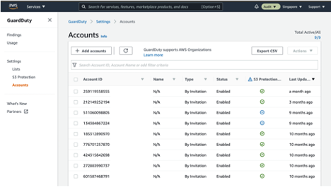
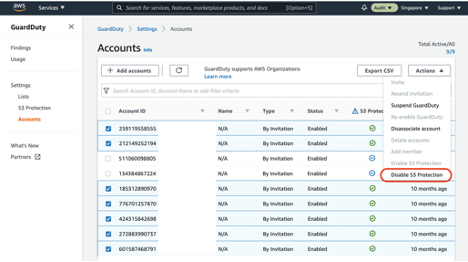
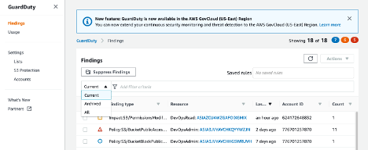
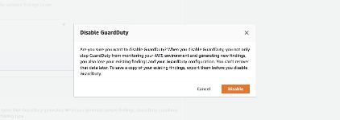

# Runbook for Turning Off Amazon GuardDuty

## Setup Using Member-Invite Method

### Benefits of Deploying Amazon GuardDuty with AWS Organizations

When integrated with AWS Organizations, any new accounts added to AWS Organizations are also automatically discovered and enabled by the GuardDuty Delegated admin without the need to turn on GuardDuty for each member account.

When integrated with AWS Organizations, it is recommended to use the Security account (as opposed to the Logging account) as the Delegated Administrator for GuardDuty, to maintain segregation of duties.

Considering that the customer is currently following a Member-Invite based deployment method, we recommend to use this guide to turn off the current model and transition to an organizations-based deployment method.

### Turn off Member-Invite Deployment

- Login to the GuardDuty Delegated Admin (Logging) account as an administrator via the AWS Management Console.

- Navigate to GuardDuty Management Console, click on Settings and then Accounts in the left panel.

- Select the relevant Member Accounts that have S3 protection enabled and click on Disable S3 protection.

- Select all the Member Accounts and click on Suspend GuardDuty under Actions.

- Select all the Member Accounts and click on Disassociate account under Actions.

- Click on Settings in the left panel and click on Suspend GuardDuty to suspend GuardDuty in the Security account.

- Click on Findings in the left panel and change the view pane to display ALL findings instead of Current findings only in the Logging account.

- Select All findings and under Actions, click on Export. Click on Download to download all findings in JSON format and you can copy this file to an S3 bucket of your choice.

- After all GuardDuty findings are exported successfully, you can go to Settings and click on Disable GuardDuty to disable GuardDuty in the existing Delegated Admin account (Logging account). Once disabled, all your existing findings and the GuardDuty configuration are lost and cannot be recovered.

- Next, we need to disable GuardDuty in all the Member accounts. To do this, login to each member account and select GuardDuty. Go to Settings  Disable GuardDuty.

Note: GuardDuty is a regional service. Before proceeding, ensure that the above actions are completed in all regions in which GuardDuty was previously enabled.
